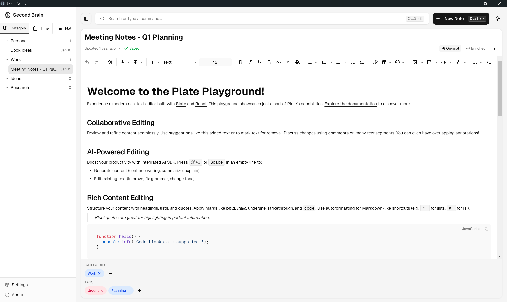

# Open Notes

_A user-owned, AI-assisted note system for building a second brain._

---

Open Notes is an open-source note-taking system built as an **experiment in creating a “second brain”** — exploring how language models can help organize, enrich, and connect human knowledge over time, while keeping control firmly in the hands of the user.

The project emphasizes **ownership, choice, and non-destructive enrichment**, allowing users to decide how their notes evolve and which intelligence powers them.

This project is currently **work in progress**.

---

## Purpose

The intent behind Open Notes is not just to store notes, but to explore:

- How notes can be enriched using language models
- How ideas can be automatically classified, tagged, and connected
- How a personal knowledge graph can emerge organically
- How AI can assist without replacing human intent

Open Notes is both a practical tool and an exploration of human–AI collaboration in knowledge work.

---

## Screenshot

_The Open Notes interface featuring a rich-text editor, sidebar navigation, note organization, and AI-assisted editing capabilities._

---

## Core Philosophy

### You Own the Notes

All notes belong to the user.  
There is no required central server and no enforced AI provider.

At the core of this philosophy is **Bring Your Own Model / Key**.

This means users are free to decide how intelligence is applied to their notes, including the ability to:

- Stay fully local
- Use private or self-hosted AI
- Connect to public AI services

The system is designed to adapt to the user’s privacy expectations, trust boundaries, and preferred tools.

---

### Non-Destructive Enrichment

One of the foundational principles of Open Notes is:

> **Original notes are never overwritten.**

- The original note always remains intact
- AI-enriched versions are stored separately
- Users can clearly distinguish between human-written and AI-generated content
- Enrichment is additive and reversible

This preserves trust, authorship, and long-term clarity.

---

## Second Brain–Inspired Design

Open Notes is inspired by second brain concepts, with an emphasis on **progressive organization** rather than rigid upfront structure.

The goal is to understand how a system can gradually reflect how a human thinks, learns, and connects ideas over time.

---

## Intelligent Organization (User-Driven)

Open Notes allows users to define their own organizational logic, including:

- Categories that act as intelligent groupings
- Category-specific prompts defined by the user
- Automatic tagging and classification guided by those prompts
- Notes belonging to multiple categories simultaneously

This keeps structure flexible while allowing intelligence to scale with usage.

---

## Enrichment & Knowledge Building (Planned)

Over time, Open Notes aims to support:

- AI-generated supplements to notes
- Auto-generated tags and classifications
- Chunking and embedding of both original and enriched content
- Semantic discovery across notes
- Emergent knowledge graphs built from relationships and context

All enrichment remains:

- Optional
- User-directed
- Model-agnostic

---

## What This Is Not

- Not a black-box AI note app
- Not a system that silently rewrites your thoughts
- Not a mandatory cloud or SaaS product
- Not a replacement for human thinking

AI remains a tool — not an authority.

---

## Status

🚧 **Work in Progress**

Open Notes is in early development and active exploration:

- Ideas are still evolving
- Features may change significantly
- Documentation will mature alongside the project

---

## Who This Is For

- People exploring second brain systems
- Knowledge workers, researchers, and learners
- Users who want AI assistance without surrendering control
- Builders interested in human-centric AI systems

---

## License

Open Notes is released under the **MIT License**.

---

## Closing Thought

Open Notes is an exploration of a fundamental question:

**How can we organize, evolve, and maintain a digital clone of a human’s knowledge — one that mirrors a person’s thinking and learning over time?**

Write · Enrich · Connect · Gift
